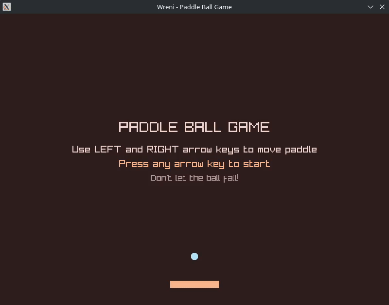

# wreni

This is a very quick, very dirty and very messy implementation of libFFI binding for [WrenVM](https://wren.io/). It is not even close to alpha-stage quality code. Just a fun experiment. Do not use it for anything. Only run on Linux x86_64, maybe MinGW support in the future.

Inspired by [tsoding](https://github.com/tsoding)'s [video on WrenVM](https://www.youtube.com/watch?v=G4Ugv18tJ5E)

This run on a modified version of WrenVM, the modification is only 1 line, see [the commit](https://github.com/thaolt/wren-lang-vm/commit/0a933f10eaa28295e487f20ba706262b05dc04f7)

## For the impatients, as I am

You will need a Linux machine, a C compiler, libffi development package installed and wget (for downloading raylib to run the example)

```sh
git clone --recursive https://github.com/thaolt/wreni.git
cd wreni
make run
```

## How it can be used

First, a Wren class must be `foreign` and extended from `FFI` class (just a dummy empty class for marking lazy loading foreign methods at runtime).

```wren
foreign class Raylib is FFI {
    #!extern(dll="raylib", args="i32,i32,char*")
    foreign static InitWindow(width, height, title)

    #!extern(dll="raylib")
    foreign static BeginDrawing()

    #!extern(dll="raylib")
    foreign static EndDrawing()

    #!extern(dll="raylib", ret="bool")
    foreign static WindowShouldClose()

    #!extern(dll="raylib")
    foreign static CloseWindow()

    #!extern(dll="raylib", args="i64")
    foreign static ClearBackground(color)
}
```

There is no need to write any more binding code. Using the class in a Wren script is as simple as:

```wren
import "raylib" for Raylib as RL

RL.InitWindow(800, 600, "Wreni")
RL.SetTargetFPS(60)
while (!RL.WindowShouldClose()) {
    RL.BeginDrawing()
    RL.ClearBackground(0xFF00FF00)
    RL.EndDrawing()
}
RL.CloseWindow()
```

## Screenshots

It just a bouncing box :D



## TODO

- Argument Parsing Optimization
- Attribute Caching Optimization
- Type System Abstraction
- Error Handling Centralization
- Support MinGW for Win32 build
